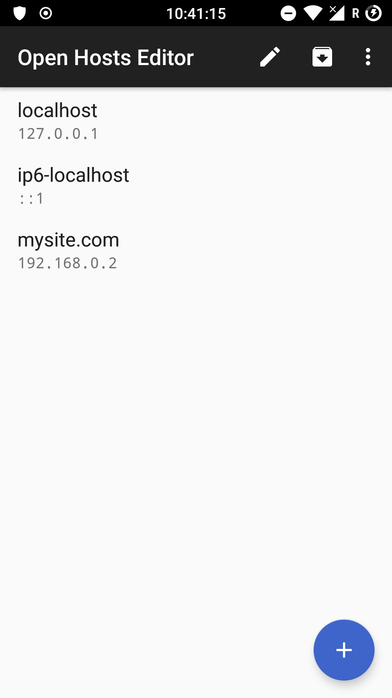
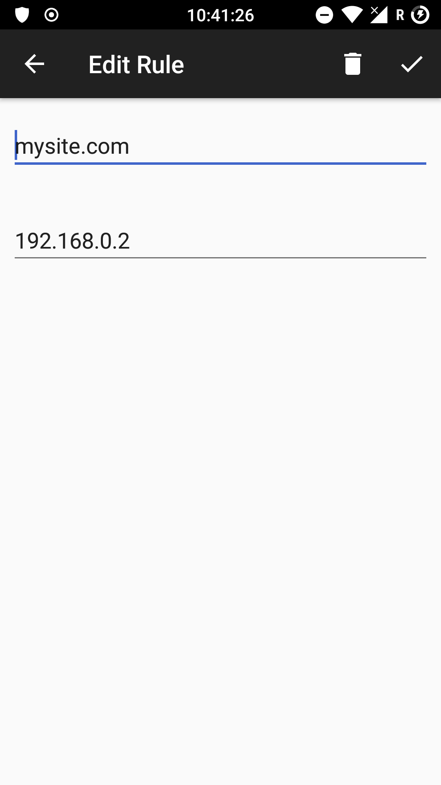
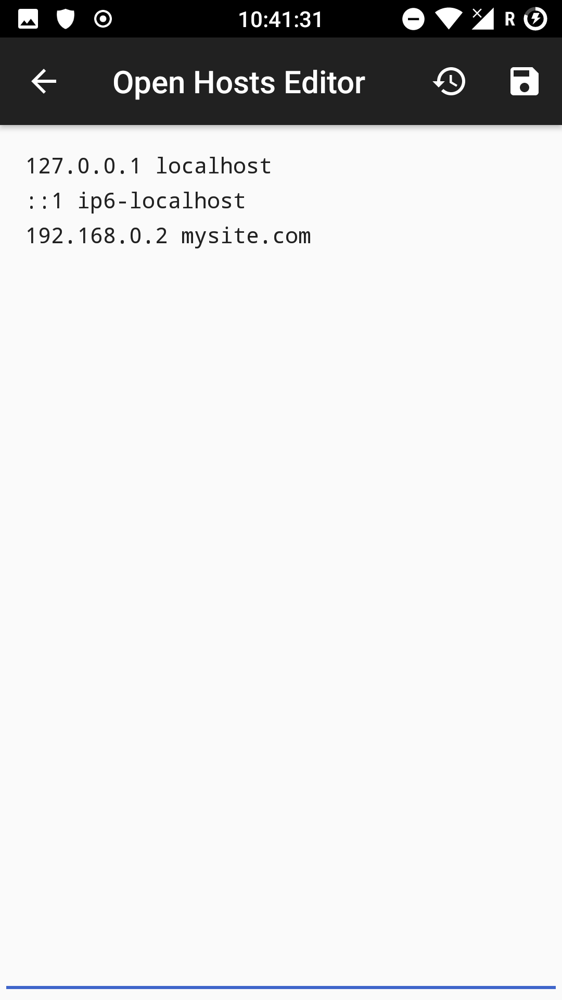

# Open Hosts Editor for Android 

 [](https://travis-ci.com/SirPryderi/open-hosts-editor)

--- 

> ⚠ **ROOT REQUIRED**

Open Hosts Editor is a free and open source application to edit the `/etc/hosts` file for Android devices.

It is available for download from [Play Store](https://play.google.com/store/apps/details?id=me.vittorio_io.openhostseditor).

Your device **must be rooted**. Not all devices have the hosts file in the same path, so it might not work on yours. 
You can submit an issue so that I can investigate.

The application is **free** and contains **no ad**.

## Contributions
> 🌍 This project is looking for translators!

Open Hosts Editor needs your help, all contributions are welcome! Open a PR, submit an issue, or suggest a feature!

[](https://ko-fi.com/I2I42ROKG)

## Screenshots

<span>
  
  
  
</span>

## Building the app
The required android SDK is 29.

The easiest way of building and running the app is by opening the project on Android Studio.

Building from the command line is equally easy, just run:

Windows:
```cmd
gradlew.bat build
```

*nix:
```bash
./gradlew build
```